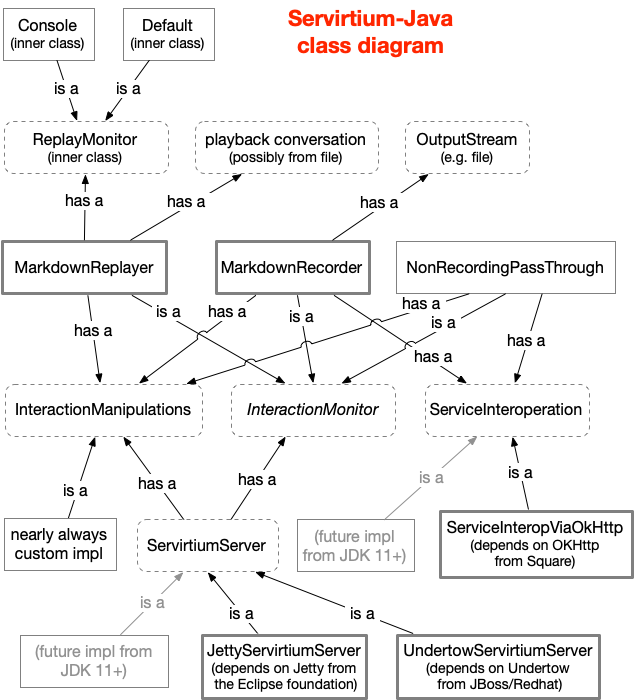

# Java using Netty, Undertow and OKHttp libraries.

Here's a class diagram for Java implementation.

You'd only copy that if it makes sense for your language. That's because doing things in an idiomatically 
correct way for your language could mean something very different. The Python version of Servertium is much more 
pythonic than the class-centric Java version.

So in the first Java implementation, there's a 
`Recorder` or `playback` that works in conjunction with a `Servirtium Server` which listens on a socket an is
a "man in the middle". That last has a dependency on Jetty or Undertow (two alternate implementations) 
Alternates in Java could be Jetty or Tomcat. All of those 
are open source web servers. There's one built into to later versions of Java, so that could be another
alternate one day. Ruby and Python had built-in web servers far sooner than Java did, so that'll be less dramatic.

Similarly, outgoing HTP requests in the Java solution is via the open source component OkHttp. Later versions 
of java build that in so at some point there'll be a implementation that does that.

Really though, Jetty and OkHttp are decent choices for this tech as it is **test time only**. Nobody's production
system will depend on this. We need functional correctness, error resilience but not million-requests a second 
scale. 

